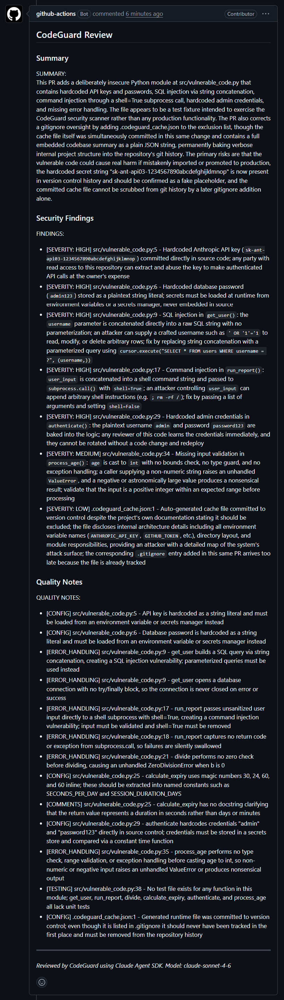

# CodeGuard

An AI-powered GitHub agent that automatically reviews pull requests for security vulnerabilities and code quality issues, and generates onboarding documentation for new repositories.

Built on the Claude Agent SDK by Anthropic.

---

## What it does

**On every pull request:**

- Scans for security vulnerabilities — hardcoded secrets, SQL injection, command injection, missing input validation
- Reviews code quality — complexity, naming, error handling, duplication, missing tests
- Generates a plain-English summary of what the PR does and what risks it introduces
- Posts all findings as a single structured comment directly on the PR

**On first push to a new repository:**

- Explores the codebase automatically using AI
- Generates `CONTRIBUTING.md`, `ARCHITECTURE.md`, and `SETUP.md`
- Commits all three files directly to the repo
- Can be re-triggered anytime by commenting `/onboard` on any PR

---

## Demo

CodeGuard reviewing a PR with intentional security vulnerabilities:



---

## Architecture

CodeGuard runs entirely inside GitHub Actions. There is nothing to host or keep alive.

**PR review pipeline:**

```
PR opened
    → GitHub Actions triggers main.py
    → gather_context.py fetches the PR diff
    → security_scan.py    (claude-sonnet-4-6)
    → quality_review.py   (claude-sonnet-4-6)
    → summarize_pr.py     (claude-haiku-4-5)
    → post_results.py posts combined comment to PR
```

**Onboarding pipeline:**

```
Push to main
    → detect_new_repo.py checks for CONTRIBUTING.md
    → explore_codebase.py maps the repo structure
    → gen_contributing.py + gen_architecture.py + gen_setup_guide.py run in parallel
    → all three docs committed directly to the repo
```

**Key engineering decisions:**

Separate agents per task — security, quality, and summary each have their own focused prompt and role. A single giant prompt produces unfocused output. Three focused agents each do one job well and fail independently.

Tool scoping — PR review agents only use the `Read` tool. The onboarding agent uses `Read`, `Glob`, and `Bash` to explore the repo. Restricting tools to the minimum needed is a real safety practice.

Model pinning by task — `claude-sonnet-4-6` for security and quality analysis, `claude-haiku-4-5` for summarization. Roughly 3x cost reduction on the summary agent with no quality drop.

Parallel doc generation — all three onboarding docs generate simultaneously using `asyncio.gather()`. Roughly 3x faster than sequential generation.

Caching — the codebase exploration result is cached by file structure hash. If the repo structure has not changed, subsequent `/onboard` triggers skip the expensive exploration step entirely.

Graceful degradation — every agent call is wrapped in try/except. If any agent fails, a fallback message is posted to the PR instead of silently crashing.

---

## Installing CodeGuard in your repo

**1. Copy the workflow file**

Add `.github/workflows/codeguard.yml` to your repo:

```yaml
name: CodeGuard

on:
  pull_request:
    types: [opened, synchronize, reopened]
  push:
    branches:
      - main
  issue_comment:
    types: [created]

permissions:
  pull-requests: write
  contents: write

jobs:
  review:
    runs-on: ubuntu-latest
    steps:
      - name: Checkout code
        uses: actions/checkout@v4

      - name: Set up Python
        uses: actions/setup-python@v5
        with:
          python-version: "3.11"

      - name: Install dependencies
        run: pip install -r requirements.txt

      - name: Run CodeGuard
        env:
          ANTHROPIC_API_KEY: ${{ secrets.ANTHROPIC_API_KEY }}
          GITHUB_TOKEN: ${{ secrets.GITHUB_TOKEN }}
          PR_NUMBER: ${{ github.event.pull_request.number }}
          REPO_NAME: ${{ github.repository }}
          EVENT_NAME: ${{ github.event_name }}
          COMMENT_BODY: ${{ github.event.comment.body }}
        run: python src/main.py

      - name: Upload session log
        if: always()
        uses: actions/upload-artifact@v4
        with:
          name: codeguard-session-${{ github.run_id }}
          path: codeguard_session.json
          retention-days: 7
```

**2. Add your Anthropic API key**

Go to your repo Settings → Secrets and variables → Actions → New repository secret:

- Name: `ANTHROPIC_API_KEY`
- Value: your key from [console.anthropic.com](https://console.anthropic.com)

**3. Add a config file (optional)**

Create `.codeguard.yml` in your repo root to customize behavior:

```yaml
security:
  enabled: true
  severity_threshold: low  # low | medium | high

quality:
  enabled: true

summary:
  enabled: true

onboarding:
  enabled: true
```

**4. Open a PR**

That is it. CodeGuard will automatically review every PR from now on.

---

## Cost

CodeGuard uses the Anthropic API which charges per token.

| Event | Estimated cost |
|---|---|
| PR review | ~$0.23 per PR |
| Onboarding (first push) | ~$1.00 one-time |
| Merge to main (docs exist) | $0.00 |
| `/onboard` re-trigger (cached) | ~$0.30 |

---

## What I learned

Prompt engineering matters more than model choice. The quality of each agent's output depends almost entirely on how well the prompt defines the role, the task, and the output format. A focused prompt on a cheaper model consistently outperforms a vague prompt on a more expensive one.

Agentic tool use needs constraints. Giving an agent unrestricted tool access in a CI environment that processes untrusted PR content is a real security risk. Scoping tools to the minimum needed is not just good practice — it is essential.

Async architecture enables real optimization. Running three doc generators sequentially vs in parallel is a 3x speed difference. Understanding async Python unlocks real performance gains in agent pipelines.

Visible failures beat silent ones. In a CI tool, if something goes wrong the developer needs to know. Wrapping every agent call in try/except and posting a fallback comment means failures are always visible, never silent.

Cost compounds quickly. At $0.23 per PR, a team opening 50 PRs a month spends roughly $11.50 per month. Model pinning, prompt caching, and caching can reduce that by 60-70% at scale.

---

## Tech stack

- Python 3.11
- Claude Agent SDK
- PyGithub
- GitHub Actions
- asyncio for parallel execution

---

*Built by Melvyn Tan*
